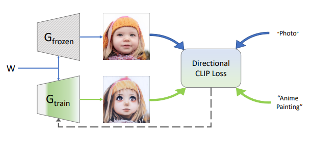
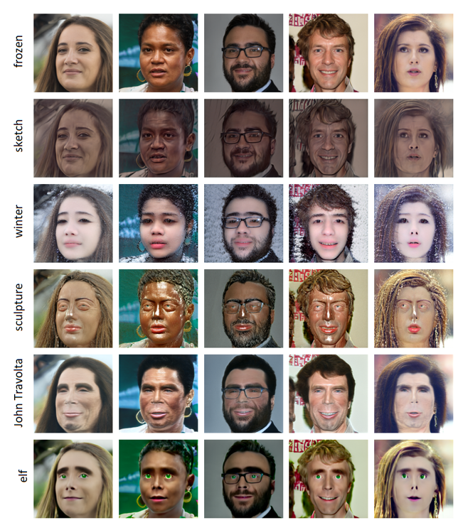
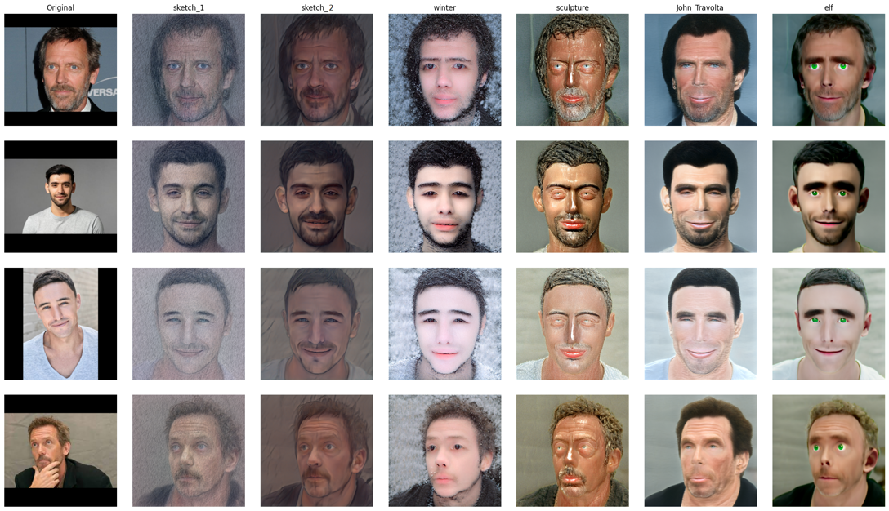

# StyleGAN-NADA Inversion & Stylization Toolkit

## About the Project

This project provides a complete pipeline for image inversion and stylization using custom-trained StyleGAN-NADA generators. It automates model setup, preprocessing, encoding, and style transfer using CLIP-guided latent manipulation.

---

## Features

- **Automatic cloning of required repositories**  
  - StyleGAN-NADA  
  - encoder4editing  

- **Automatic installation of Python dependencies**  
  - `ninja`, `CLIP`, `dlib`, `torch`, `face_alignment`, etc.

- **Automatic download of pre-trained models**  
  - `dlib` shape predictor  
  - pSp encoder (`e4e_ffhq_encode.pt`)

- **Support for multiple custom StyleGAN-NADA generators**

- **Random image generation**  
  - Generate random samples using any loaded StyleGAN-NADA generator

- **Image inversion and stylization pipeline**  
  - Face alignment  
  - Latent encoding using pSp  
  - Stylization via StyleGAN-NADA latent transformation

- **Result visualization**  
  - Side-by-side display of original and stylized outputs

---

## Getting Started

### Requirements

- Google Colaboratory (**recommended**)  
- Access to GPU (Colab free tier or Pro)

---

## Installation & Usage

### 1. Open in Google Colab

If you're using `.ipynb` notebooks:

- Create a new notebook in Google Colab
- Copy the content of `main.py` or use the provided:
  - `01_Train_StyleGAN_NADA.ipynb`
  - `02_Inference_StyleGAN_NADA.ipynb`
  - `03_Experiments_StyleGAN_NADA.ipynb`

### 2. Run all cells

Go to:  
**Runtime → Run all** (or **Среда выполнения → Запустить все**)

### 3. Download models

- All required pre-trained models will be downloaded automatically.
- **Important**: Make sure to update the Google Drive IDs in the `stylegan_nada_generators` dictionary to load your custom generators.

### Examples:

---

## Preparing Images for Inversion

1. Place your `.png`, `.jpg`, or `.jpeg` images into the following folder:

2. You can drag and drop images directly into the Colab file panel.

---

## How It Works

After running all the cells:

- A few random samples will be generated using the first available generator  
- All images found in `/data/inversion/` will be processed:
- Face alignment → Latent encoding → Stylization
- Visual comparison between original and stylized images will be displayed

---

## Feedback

If you find a bug or want to suggest an improvement, feel free to open an [issue](https://github.com/uko3/StyleGAN-nada) or submit a pull request.

---

